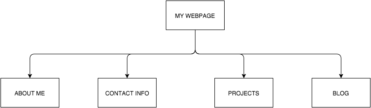

#What are the 6 Phases of Web Design?
 The six phases of web design are information gathering, planning, design, development, testing &delivery, and maintenance.
 Information gathering is the first step and usually the most important one. Before making a website, it is important to gather all the information you need in order to build it. what the goals of the website are and how these goals can be achieved are important things to think about. Certain things that need to also be considered are what the purpose of the website is, what the goal of the website is, whether or not there is a  a specific group of people you’re targeting your website for, and what kind of information that target audience will be looking at in your website.
 Planning is the second phase and it is where you create a site map. Here, you outline all the main topics and subtopics of the site. It is important to decide what technologies will be implemented on the site as well.
 Design  is the third phase. Here, you look at all the information you gathered and you determine how your website will look.
 Development is the fourth phase, and it is where the website itself is created. This is where graphic elements are implanted to create a functional website.
 Testing and delivery is the fifth phase. This is where functionality is tested as well as where the website is optimized to be viewed properly in the most recent web browser versions.
 Maintenance is the sixth phase. It is where the website is updated with new content, if necessary. Many different things need updates as time goes by.
#What is your site's primary goal or purpose? What kind of content will your site feature?
 The primary purpose of my site is to tell future employers a little bit about myself and to show them my projects. Also, it is something I will use to network with other software developers.  My site will show the projects I work on and create during my time at DBC and what I create in my professional career.
#What is your target audience's interests and how do you see your site addressing them?
 The interests of the target audience are to get to know me a little bit and to see some of my work.
#What is the primary "action" the user should take when coming to your site? Do you want them to search for information, contact you, or see your portfolio? It's ok to have several actions at once, or different actions for different kinds of visitors.’
 The first thing I want the users to do when they enter my site, is to read about me.Then they could see my portfolio. Then afterwards, they could contact me and follow me on github and they could connect with me on twitter or on Facebook. They could also use linkedin to reach me. But first and foremost, I would want people to read about me and who I am and what I do for fun. Yes, this site will feature my portfolio, but I believe it is important for them to know what type of person I am first.
#What are the main things someone should know about design and user experience?
 The main things someone should know about user experience is that it is how a person feels when he or she is interacting with technology. Designing user experience is very important because we live in a world where technology has revolutionized the way we live, and it is imperative for us to optimize how we interact with technology, and to keep making it better and better as time goes by.
#What is user experience design and why is it valuable?
 User experience is how a person feels when interfacing with a system. User centered design is important for many reasons.It is important because it deals with user’s needs and because it is our job to try to make it accessible to everyone in the world. People gain from free trade, and the internet is free trade, free trade of knowledge. If everyone in the world was connected, we could expose ignorance and expose important issues in our planet.
#Which parts of the challenge did you find tedious?
 Making the site map was the most tedious thing for me. I could not figure out how to make it on the website I ended up using. There were some parts of this challenge that were ambiguous because we didn’t have proper directions. I also had a very hard time finding the right path for the image. It was frustrating.
