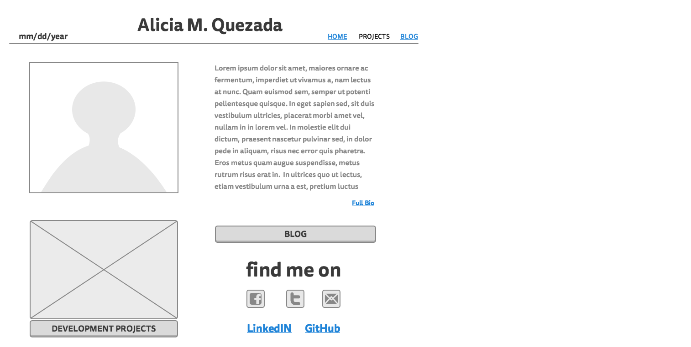
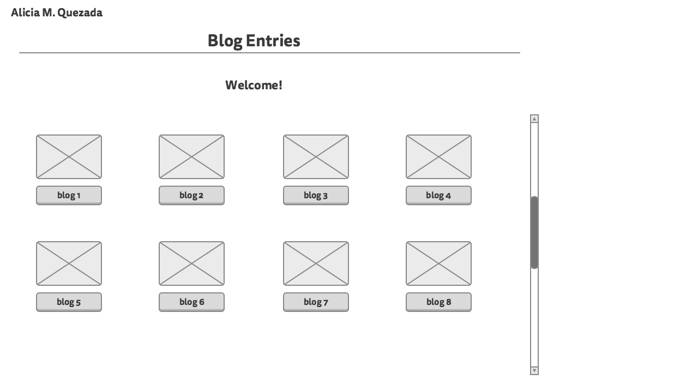

#2.4 Wireframing
##Index frame

##Blog frame

###What is a wireframe?
A wireframe is a general sketch of how information will be displayed in the website you are creating. To be exact, it is an image or set of images which displays the functional elements of a website or page, typically used for planning a site's structure and functionality.
###What are the benefits of wireframing?
Wireframing helps you create the general layout of the site or app you are planning on creating. It is similar to a quick sketch of a house you want to build. A wireframe is also very useful in determining how the user interacts with the interface, therefore it is a essential to the design process. It is also good to use it if you're trying to find the optimal layout of your screen because it provides a quick visual representation.
###Did you enjoy wireframing your site?
It was enjoyable to wireframe my site. I wish I had more time to play around with it more and make it more professional.
###Did you revise your wireframe or stick with your first idea?
I stuck to the first idea because I didn't want to complicate things too much. I kept it simple.
###What questions did you ask during this challenge? What resources did you find to help you answer them?
I originally did not know how to use mockingbird to create a wireframe, until I partnered up with another student for a challenge and he helped me create a wireframe. I learned to create a wireframe on mockingbird thanks to him.
###Which parts of the challenge did you enjoy and which parts did you find tedious?
I enjoyed creating the wireframe for the blog and for my main site. It is pretty cool to have a relative idea of what they will look like later. At first I didn't know how to use the website I used to create the wireframes, so that was tediuos.Later I found out how to use it and it went smooth.