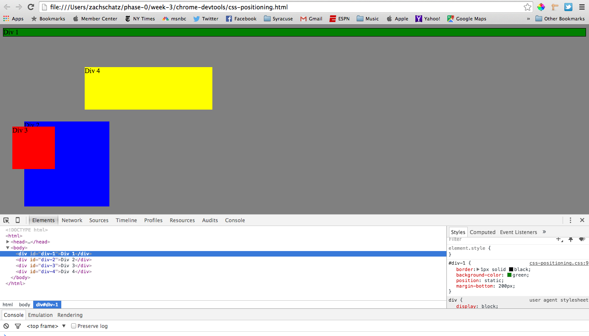
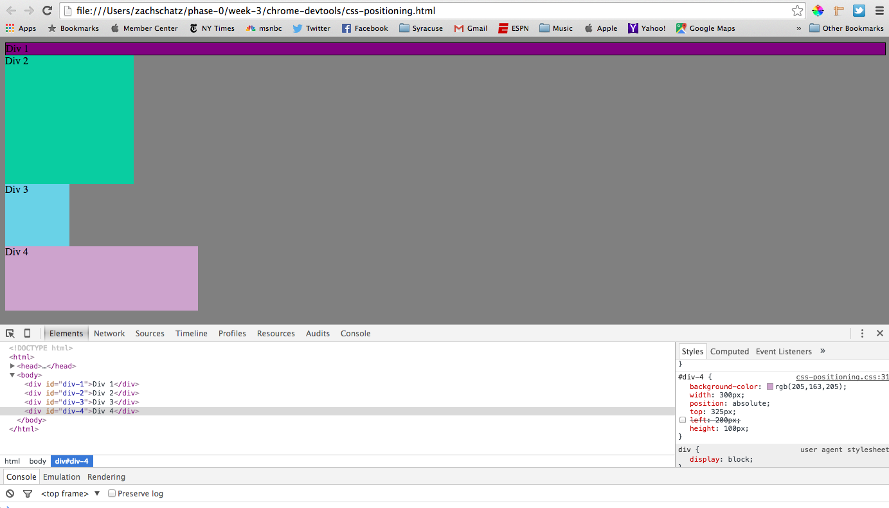
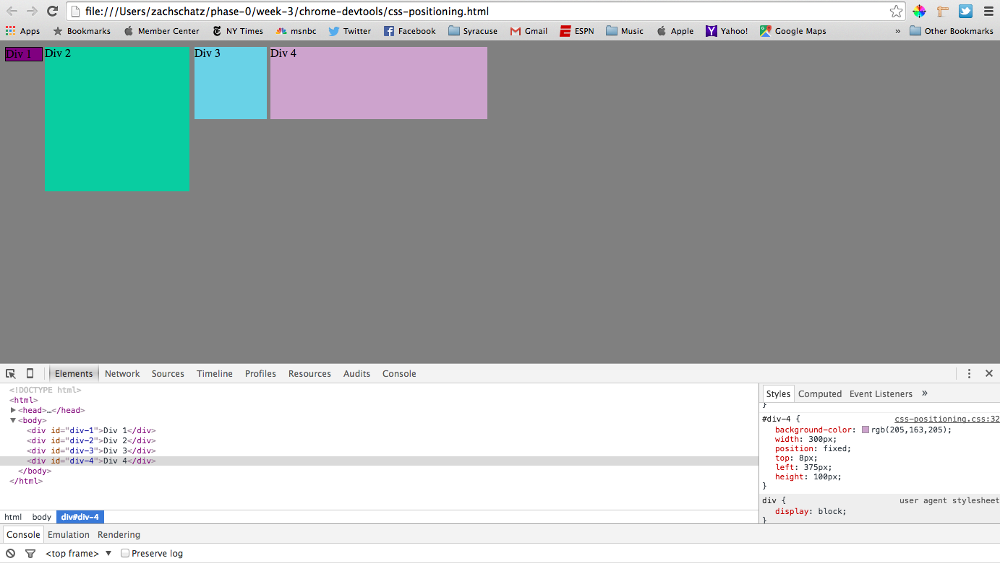
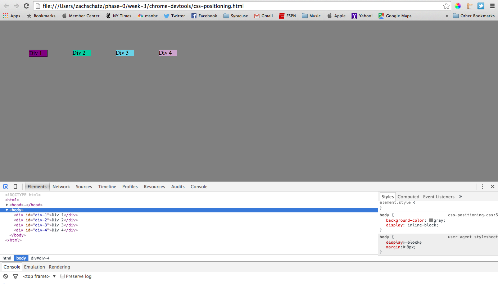
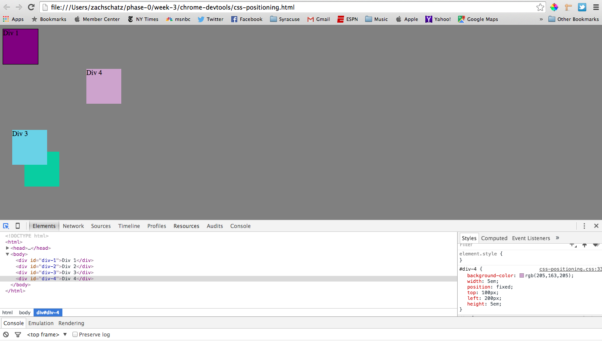
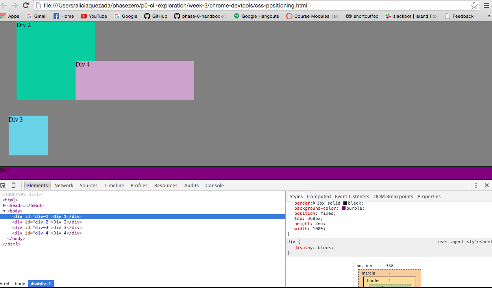
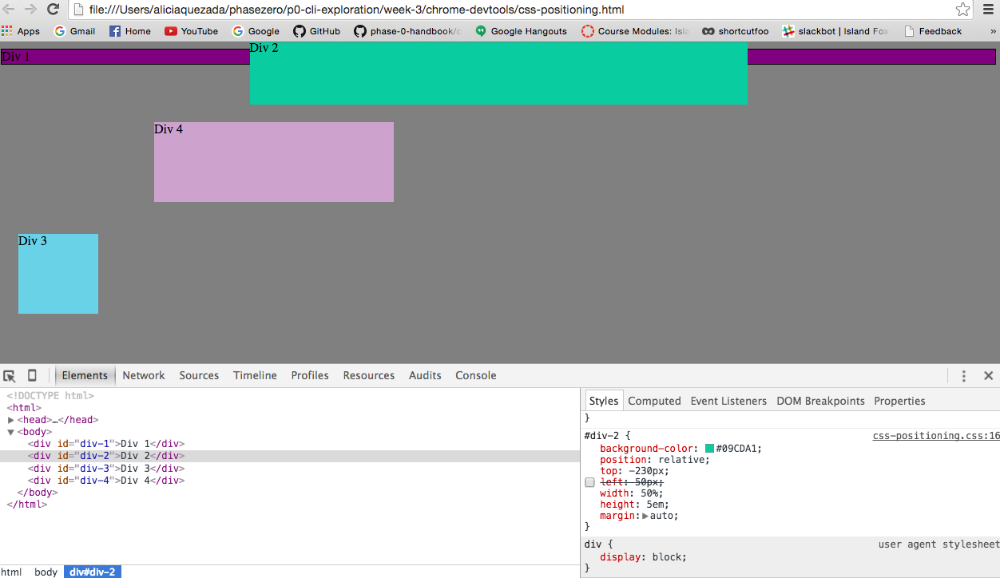
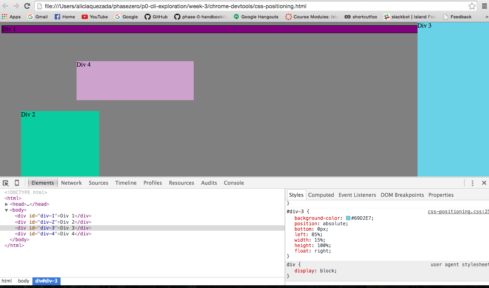
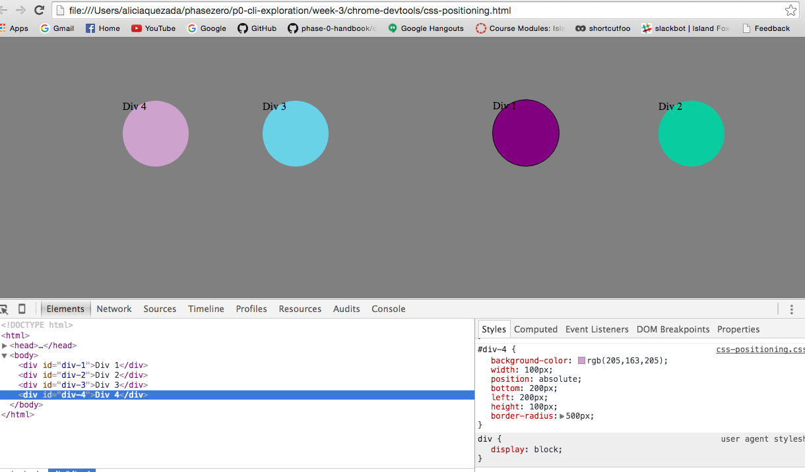

##How can you use Chrome's DevTools inspector to help you format or position elements?
--Chrome's DevTools gives you an instant view at what your website looks like when you make changes to the css. It can help you cross out things or add new things and you immediately see the change. It can also help you inspect your elements and it allows you to select the things on your website to make youre you're making changes to the right section.
##How can you resize elements on the DOM using CSS?
-- If you apply your changes to the html tag, your whole "tree" will be affected. The resize property specifies whether or not an element is resizable by the user, and it can be specified in css. use "resize:both" to allow the user to adjust both the height and width of the element.
##What are the differences between Absolute, Fixed, Static, and Relative positioning? Which did you find easiest to use? Which was most difficult?
-- Static is the default value and it is where elements render un order as they appear in the document flow. Absolute is where the element is positioned relative to its first positioned (not static) ancestor element. Fixed is where the element is positioned relative to the browser window. Relative is where the element is positioned relative to its normal position, so if you add pixels to a side, thats how much the element will move to that side.
##What are the differences between Margin, Border, and Padding?
--The margin is the outermost part from the edge of the site inwards. The border is the border of each element where you have content. Padding is from the border inwards to your  It is difficult to explain without using a picture. It is like an onion. The outermost part of it is the margin, and the second layer down is the border. Then the layer after border is padding, and after padding is your main content.
##What was your impression of this challenge overall? (love, hate, and why?)
-- I really liked it because it gave me an idea of how I will be positioning my website later on. It was a little difficult at times because we're very new to CSS but it was mostly like solving a puzzle, and it was enjoyable but frustrating at times.