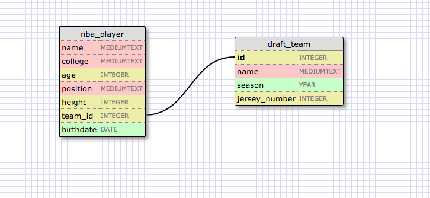
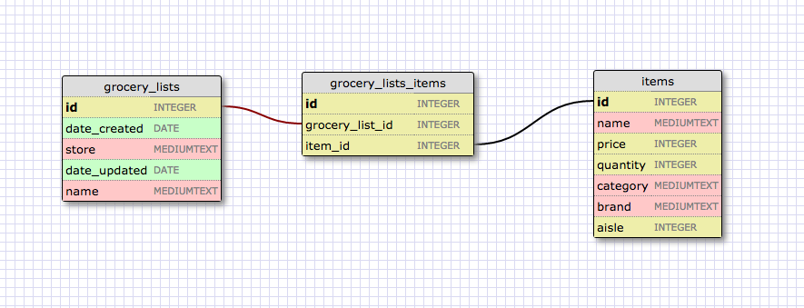

#####This relationship is a one to one relationship because each nba player can only be drafter by one team in a specific round and each team can only draft one player in a specific round at the nba draft. For example, in round 1 of the NBA Draft in 1984, the Chicago Bulls got the 3rd pick, that 3rd pick being Michael Jordan. That was the only player they picked in round 1.

####What is a one-to-one database?
#####One-to-one relationships are used when instances of entities can have a single relationship to one another. It is the relationship between two tables where both the tables should be associated with each other based on only one matching row.
####When would you use a one-to-one database? (Think generally, not in terms of the example you created).
#####A one-to-one database can be used when you want to have singular relationships between two entities.
####What is a many-to-many database?
#####A many-to-many relationship refers to a relationship between tables in a database when a parent row in one table contains several child rows in the second table, and vice versa. Many-to-many relationships are often tricky to represent.
####When would you use a many-to-many database? (Think generally, not in terms of the example you created).
#####You would use many-to-many relationships when you have to relate more than one entity in a table to more than one entity in another table.
####What is confusing about database schemas? What makes sense?
##### To me it is a little difficult to understand when it is not appropriate to use a one-to-one relationship. Earlier I tried doing a design for a one-to-one relationship and when I really thought about it a lot it didn't work out so well.Other than that, everything seems to be easy to understand thus far.